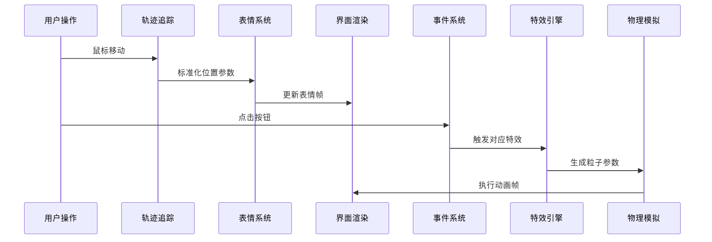

# 🎓 Academic Verdict Simulator | 论文评审互动模拟器

 <!-- 请替换为实际演示GIF路径 -->

一个融合贝塞尔曲线追踪与粒子动画的交互式论文评审模拟器，生动再现学术论文被接受/拒绝的戏剧性时刻！✨

---

## 🌟 项目亮点

### 🎨 创新交互设计

- **动态表情系统**：13 帧精细表情动画，模拟从紧张到欣喜的全过程
- **智能轨迹追踪**：基于二次贝塞尔曲线的光标路径预测算法
- **多模态反馈**：粒子爆炸 + 弹性动画 + 音效级视觉提示

---

## 🛠️ 核心技术栈

graph LR
A[光标追踪] --> B(贝塞尔曲线路径预测)
B --> C{表情帧映射}
C --> D[粒子系统]
D --> E[CSS 动画引擎]

## 🚀 功能特性

### 🖱️ 交互系统

- 📍 **智能路径预测**：通过预计算的贝塞尔曲线路径点，实现丝滑的轨迹追踪
- 🎯 **非线性映射**：将光标位置映射到 13 个表情帧的智能插值算法
- 🌈 **多通道反馈**：触发表情变化 >90% 时触发界面微动效

### ✨ 特效系统

| 特效类型        | 触发条件    | 技术实现                  |
| --------------- | ----------- | ------------------------- |
| 🎉 粒子爆发     | Accept 点击 | 动态 DOM 创建 + CSS3 动画 |
| 💔 界面震颤     | Reject 点击 | CSS 关键帧动画 + 弹性函数 |
| ❤️ 心跳动画     | 成功状态    | 缩放变换 + 缓动函数       |
| 🔍 磨砂玻璃效果 | 容器背景    | backdrop-filter 模糊滤镜  |

## 🧮 实现原理

### 核心算法解析

```python
# 伪代码示例：贝塞尔路径投影算法
def calculate_position(e):
    # 获取标准化坐标
    mouse_x = e.x - container.x
    mouse_y = e.y - container.y

    # 在预计算路径中寻找最近点
    min_distance = INF
    best_t = 0
    for point in path_points:
        distance = sqrt((mouse_x - point.x)^2 + (mouse_y - point.y)^2)
        if distance < min_distance:
            min_distance = distance
            best_t = point.t

    # 非线性插值优化
    return smoothstep(best_t)
```

### 🎞️ 动画系统架构



---

## 🛠️ 使用指南

### 快速开始

1. 克隆仓库

```bash
git clone https://github.com/xi029/FaceFlow.git
```

1. 准备表情帧图片（`1.png` ~ `13.png`）放置于项目根目录
2. 使用现代浏览器打开 `paper.html`

## 📦 文件结构

├── ass/ # 资源文件
│ ├── frames/ # 表情帧图片
│ └── avs.gif # 演示动图
├── paper.html # 主界面

## 🧪 效果优化建议

- 使用 Adobe After Effects 制作专业级表情动画序列
- 集成 Three.js 实现 WebGL 粒子效果
- 添加音效反馈系统（推荐使用 Howler.js）
- 实现移动端触摸事件支持

---

## 🤝 参与贡献

欢迎提交 PR！建议流程：

1. Fork 项目
2. 创建特性分支

```bash
git checkout -b feature/AmazingFeature
```

1. 提交更改

```bash
git commit -m 'Add some AmazingFeature'
```

1. 推送到分支

```bash
git push origin feature/AmazingFeature
```

1. 发起 Pull Request

---

## 📜 开源协议

本项目采用 [MIT License](https://opensource.org/licenses/MIT)，请自由使用但保留原始署名。

---

🚀 **欢迎 Star & Fork 支持本项目！** 🎉
